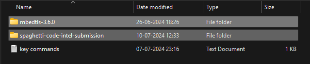

# PS-5 Cryptography simulation with mbedtls/openSSL library usage and user interaction

building a crypto wrapper around a udp client/server communication to encrypt messages using [mbedtls](https://www.trustedfirmware.org/projects/mbed-tls/).

# Links for demonstration video and presentation

- [video link]()
- [presentation link]()

# Prerequisites

- Windows Visual Studio 2013 or later with 'Desktop development for C++' workload installed.
- Compiled and built version of mbedtls. [Follow this guide to build mbedtls]().

# Project setup guide

- <b>It is highly recommended to keep `mbedtls-3.6.0` and project in a same directory as shown in figure to skip all the setup steps mentioned below.</b>

- otherwise follow the steps to edit project properties.
- Double click `udp_party.sln` file to open solution in Visual Studio. You will be able to see two projects in this solution first `crypto_test` and second `udp_party`.
- Right click on the `crypto_test` in Solution Explorer and go to `Properties > C/C++ > General > Additional Include Directories` and add `(your_mbedls_location)/mbedtls-3.6.0/include`. click OK.
- Now go to `C/C++ > Preprocessor > Preprocessor Definitions` and add `MBEDTLS;` in the beginning.
- Now go to `Linker > General > Additional Library Directories` and add `(your_mbedls_location)/mbedtls-3.6.0/visualc/VS2017/x64/Release/`. Click OK.
- follow same steps for `udp_party` project.
- now you should be able to build both projects.

# Command-line arguments to run `udp_party` project (provided in `params.txt`)

- build project using `ctrl+shift+b`.
- Navigate to folder where `udp_party.exe` is located. Usually it is `(projectDir)/x64/Debug/`.
- Open two terminals in this folder for client and server.
- for server: `.\udp_party.exe -port 6000 -key ..\..\certificates\alice.key -pwd securepassword -cert ..\..\certificates\alice.crt  -root ..\..\certificates\rootCA.crt -peer BOB`.
- for client: `.\udp_party.exe -ip 127.0.0.1 -port 6000 -key ..\..\certificates\bob.key -pwd securepassword -cert ..\..\certificates\bob.crt -root ..\..\certificates\rootCA.crt -peer ALICE`.
